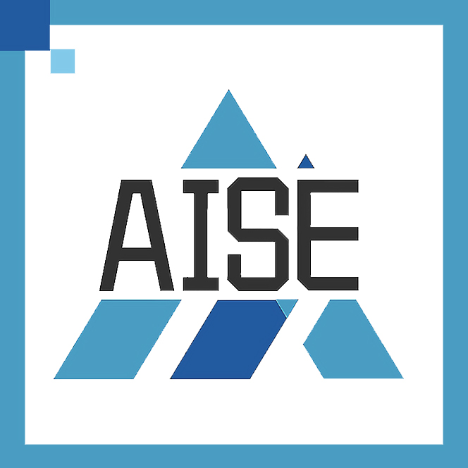

# Neural Copilot — Your AI programming assistant for VSCode

Neural Copilot is a VSCode plugin that serves as your AI programming assistant, which supports the following features:
- 💬 Get streaming answers to your prompts in sidebar conversation window.
- ➡️ Copy code from conversation with just one click, NeuralChat is suggesting right into your editor.
- 📝 Autocomplete-style code suggestions as you write code.
- 😊 Easily switch between high quality mode and fast mode according to your needs.
---

Table of contents:

- [Neural Copilot — Your AI programming assistant for VSCode](#Neural-Copilot--code-suggestion-for-vscode)
  - [1. Install extension from the marketplacet](#1-install-extension-from-the-marketplacet)
  - [2. Installation for Development](#2-installation-for-development)
  - [3. How to use](#3-how-to-use)
    - [Chat with AI assistant](#chat-with-ai-assistant)
    - [Code suggestion](#code-suggestion)
    - [Switch mode](#switch-mode)

---
## 1. Install extension from the marketplacet

Not supported yet, please refer to [Installation for Development](#2-installation-for-development) to try the plugin for now.

## 2. Installation for Development

To install and starting Neural Copilot:

1. Set up Node environment version 14 or higher:
```
curl -o- https://raw.githubusercontent.com/nvm-sh/nvm/v0.38.0/install.sh | bash
source ~/.bashrc
nvm install 18.17.1
nvm use 18.17.1
node -v
```

2. Clone this repository to your PC using `git clone https://github.com/WenjiaoYue/copilot`.

2. Change working directory to project folder using `cd copilot`.

3. Run `npm install` in the terminal to install dfependencies.

4. Now, you can start the extension. From the top menu, choose `Run > Start Debugging`.

This will:

- Start a task `npm: watch` to compile the code and watch for changes.
- Open a new VSCode window (you should use the extension there).

_Note: When you make changes, you should refresh that window to apply changes. To refresh, open Command Palette (Command+Shift+P on MacOS, or Ctrl+Shift+P on Windows), then choose "Developer: Reload window"_

## 3. How to use
### Chat with AI assistant
You can start a conversation with the AI programming assistant by clicking on the robot icon in the plugin bar on the left:


Then you can see the conversation window on the left, where you can chat with AI assistant:


There are 3 areas worth noting:

1. Enter and submit your question
2. Answers from AI assistant (streaming output)
3. Copy code with one click

### Code suggestion
To trigger inline completion, you'll need to type `// {your keyword}` (start with your programming language's comment keyword, like `//` in C++ and `#` in python).

For example:

```py
# binary search in python.
```

Make sure `Inline Suggest` is `enabled` from the VS Code Settings.

You can also select the code in the editor and let the AI coding assistant help you modify the selected code：


### Switch mode
Neural Copilot supports both high quality mode and fast mode, and allows you to switch between them with one click according to your needs：
- High quality mode: Using remote server's service
- Fast mode: Using local local client's service

To switch between the two modes, you can click on the icon in the upper right corner:


You can modify the service url used by the two modes in package.json:


